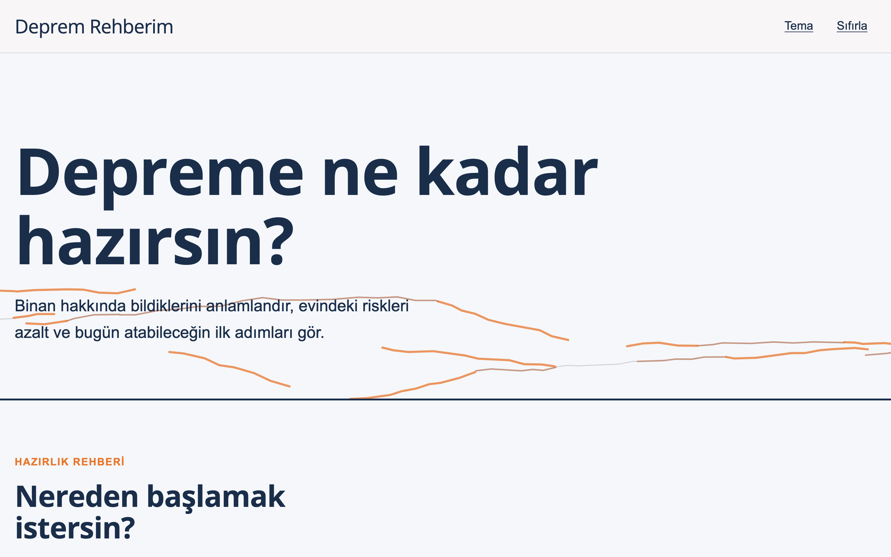
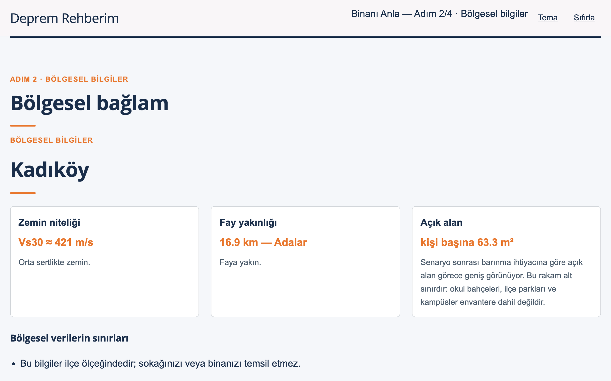
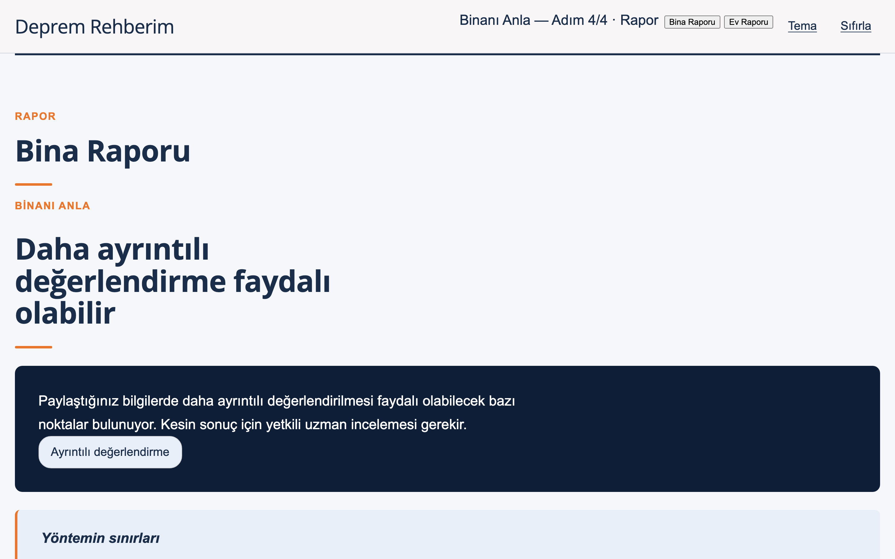
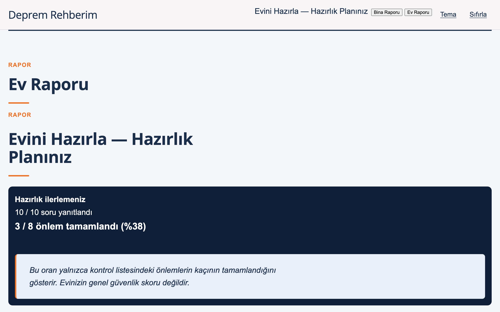
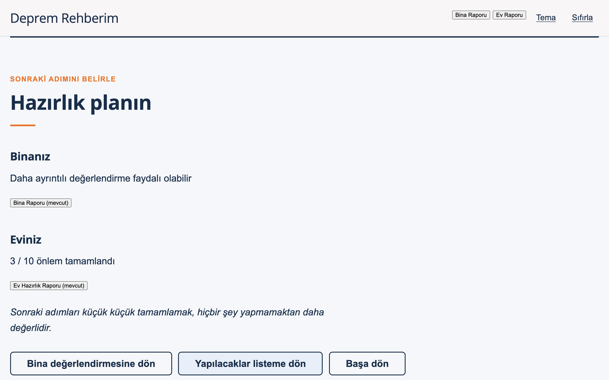

# Deprem Rehberim

Depreme hazırlık veri ile değil, eylemle başlar.



İstanbul için deprem hazırlığı değerlendirme aracı. İki bağımsız modül ve
bunları birleştiren bir hazırlık planı sunar:

1. **Yapısal Ön Değerlendirme** — binanız hakkında bildiklerinizi gözden
   geçirir ve profesyonel değerlendirmeye ne kadar öncelik verilmesi
   gerektiğini gösterir.
2. **Yapısal Olmayan Risk Kontrolü** — ev içinde devrilebilecek, düşebilecek
   veya çıkışı engelleyebilecek riskleri 10 soruluk bir kontrol listesiyle
   tarar.

Kullanıcı iki modülden hangisiyle isterse başlayabilir. Biri tamamlanmadan
diğerine geçmek engellenmez, özet ekranı tek modülle de çalışır.

## Bu uygulama ne yapmaz

- Resmî bina risk tespiti veya riskli yapı tespiti **yapmaz**.
- Deprem performans analizi **yapmaz**.
- Göçme olasılığı veya sayısal güvenlik skoru **üretmez**.
- Gerçek zemin etüdü **değildir**.
- Hukuki veya mühendislik danışmanlığı **değildir**.
- Binanın güvenli olduğuna dair hiçbir güvence **vermez**.

## Gizlilik

- **Kayıt yok.** Üyelik, giriş, e-posta, telefon, parola, TC kimlik numarası
  veya profil istenmez. Ürünün hiçbir yerinde hesapla ilgili bir çağrı yoktur.
- **Sunucu yok.** Girilen hiçbir bilgi bir sunucuya gönderilmez. Uygulama
  statik dosyalardan ibarettir; arka uç, veritabanı ve API çağrısı yoktur.
- **Analitik yok.** İzleme pikseli, çerez veya analitik betiği kullanılmaz.
- **Kalıcı depolama yok.** `localStorage`, `sessionStorage`, `IndexedDB` ve
  çerez kullanılmaz. Bütün durum yalnızca bellekte tutulur.
- **Sayfayı yenilediğinizde veya kapattığınızda girilen bilgiler silinir.**
- Adres alanları yalnızca ilçe ölçekli bölgesel bilgiyi göstermek için
  kullanılır ve tarayıcıdan çıkmaz.

### Konumdan ilçe bulma

Adres adımındaki "Konumumu bul" düğmesi isteğe bağlıdır ve yalnızca
tıklandığında çalışır; sayfa açılışında konum istenmez. Tarayıcıdan alınan
koordinat, uygulamaya gömülü ilçe poligonlarıyla (`ilceBul`) **yerel olarak**
ilçeye çevrilir. Coğrafi kodlama servisi, harita servisi veya adres API'si
çağrılmaz; koordinat hiçbir yere gönderilmez ve saklanmaz. Bulunan ilçe
listede seçilir, kullanıcı dilerse elle değiştirir.

Tarayıcının kendi konum belirleme mekanizmasının (Wi-Fi/hücre tabanlı konum
sağlayıcı) işletim sistemi düzeyinde dış bir servise başvurabileceğini not
edin; bu uygulamanın denetimi dışındadır. Düğmeye hiç dokunmadan ilçeyi elle
seçerek akış eksiksiz tamamlanabilir.

Tek dış istek Google Fonts'a yapılan yazı tipi isteğidir. Kullanıcı verisi
taşımaz. Tamamen çevrimdışı çalıştırmak isterseniz `scripts/build_app.py`
içindeki `ISKELET` sabitinden font `<link>` etiketlerini çıkarın.

Servis çalışanı (`sw.js`) yalnızca uygulama dosyalarını çevrimdışı kullanım
için önbelleğe alır; kullanıcı yanıtlarını saklamaz.

## Bölgesel veri ile yapısal sonuç arasındaki ayrım

Bu iki şey kasıtlı olarak birbirinden ayrılmıştır:

**Bölgesel bilgiler gerçektir.** İlçe ölçeğinde İBB + Kandilli deprem
senaryosu, USGS Vs30 zemin ızgarası ve Türkiye diri fay verisinden gelir.
Kaynakları `KAYNAKLAR.md` içinde listelidir. Ekranda niteliksel olarak
sunulur ve **yapısal sonucu etkilemez**. Bir bölgenin deprem tehlikesi ile
bir binanın yapısal performansı aynı şey değildir.

**Yapısal sonuç bir prototiptir.** `deriveDemoStructuralPriority()` yalnızca
bir arayüz yönlendirme mantığıdır — mühendislik modeli değildir, sayısal
değer üretmez ve bölgesel veriyi girdi olarak almaz. Üretimde doğrulanmış
bir değerlendirme servisiyle değiştirilmek üzere izole tutulmuştur.

Önceki sürümdeki 0–100 risk skoru, `SEVIYELER` bantları ve puan tabanlı
zemin/fay/kat ağırlıklandırması kaldırılmıştır.

## Ekran görüntüleri

| | |
|---|---|
|  |  |
| Bölgesel bağlam — ilçe ölçeğinde zemin, fay ve açık alan. Yapısal sonucu etkilemez. | Bina raporu — skor yerine sonraki adım; yöntemin sınırları hemen altında. |
|  |  |
| Ev raporu — tamamlanmayan önlemler aciliyete göre sıralı. | Hazırlık planı — iki modülün birleşimi, tek modülle de çalışır. |

Kareler `node promo/capture.mjs` ile yeniden üretilir; akışı yürütüp her
duraktan retina çözünürlükte görüntü alır.

## Tanıtım videosu

`promo/` altında Remotion ile yazılmış 40 saniyelik bir tanıtım vardır. Ekran
görüntülerini girdi olarak kullanır, uygulamanın kendi paletini ve yazı tipini
(Open Sans) taşır. Fontlar `promo/public/fonts` altında yereldir; render ağa
çıkmaz.

```bash
cd promo
npm install
node capture.mjs      # ekran görüntülerini tazele (istenirse)
npm run studio        # önizleme
npm run render        # -> promo/out/deprem-rehberim.mp4
```

Remotion'un kendi lisans koşulları vardır; belirli bir takım büyüklüğünün
üzerindeki şirketler için ücretlidir. Bkz. [remotion.dev/license](https://remotion.dev/license).

## Çalıştırma

Sunucu gerekmez. `index.html` çift tıkla açılır.

```bash
python3 -m http.server 8000    # istenirse
```

Servis çalışanı yalnızca `https` veya `localhost` üzerinde etkinleşir;
`file://` ile açıldığında sessizce atlanır.

## Derleme

Kaynaklar `scripts/` altındadır, `build_app.py` hepsini tek bir `index.html`
dosyasına gömer.

```bash
python3 scripts/build.py        # ham veri -> derived/*.csv   (yalnızca veri değişince)
python3 scripts/app_data.py     # derived/*.csv -> scripts/_app_data.json
python3 scripts/build_app.py    # -> index.html
python3 scripts/build_map.py    # -> harita.html  (ayrı sayfa)
python3 scripts/build_pwa.py    # -> manifest + sw.js + ikonlar
```

Gömme sırası: `app_style.css` → `app_body.html` → `_app_data.json` (global
`D`) → `risk_engine.js` → `nonstructural.js` → `app_main.js`. Modül sistemi
yoktur; her betik bir öncekinin global tanımlarını görür.

`risk_engine.js` ve `nonstructural.js` dosyalarının sonundaki
`module.exports` bloğu Node ile test edebilmek içindir; `build_app.py`
tarayıcı çıktısından bu bloğu siler.

## Kaynak dosyalar

| Dosya | Sorumluluk |
|---|---|
| `scripts/app_body.html` | Bütün ekranların işaretlemesi. 11 bölüm, biri görünür. |
| `scripts/app_style.css` | Stiller. |
| `scripts/risk_engine.js` | Coğrafi yardımcılar, 7 yapısal soru, sonuç türetme, bölgesel bağlam, birleşik özet. |
| `scripts/nonstructural.js` | 10 maddelik ev içi kontrol listesi ve görev/yüzde yardımcıları. Tek doğruluk kaynağı. |
| `scripts/app_main.js` | Akış kontrolü, durum, çizim. |
| `scripts/build_app.py` | Tek dosyaya paketleme. |

Ev içi kontrol listesi yalnızca `nonstructural.js` içinde tanımlıdır ve
kentsel dönüşüm süreç verisinden türetilmez.

## Yapısal sonuç durumlarını açma

Dört durum sorgu parametresiyle doğrudan açılabilir:

```
index.html?scenario=priority        Öncelikli uzman değerlendirmesi öneriliyor
index.html?scenario=detailed        Daha ayrıntılı değerlendirme faydalı olabilir
index.html?scenario=clear           Belirgin bir uyarı tespit edilmedi
index.html?scenario=insufficient    Değerlendirme için bilgi yetersiz
```

Senaryo modunda ekranın sağ üstünde bir etiket görünür. Sonuç, üretimdeki
mantığın aynısıyla temsili bir yanıt kümesinden türetilir.

## harita.html

Katmanlı keşif haritası ayrı bir sayfadır ve bu değerlendirme akışının
parçası değildir. Genel bilgi amaçlıdır. Kendi Leaflet bağımlılığını
kullanır; değerlendirme sihirbazı harita veya konum servisi kullanmaz.

## Temalar

İki tema vardır, üst bardaki **Tema** düğmesiyle değişir:

- **sade** (varsayılan) — ürünün sunum destesinden alınan palet: zemin
  `#f5f7fa`, kart `#ffffff`, lacivert `#1a2e4a`, turuncu vurgu `#e8762c`,
  mavi `#1a4a9a`.
- **canli** — daha canlı alternatif: mercan `#ff4f40`, nane `#f2f8f3`,
  yuvarlak hatlar.

Tema seçimi bellekte tutulur, hiçbir yere yazılmaz; sayfa yenilenince
varsayılana döner. Her iki temada da sonuç durumları renkten bağımsız olarak
simge, etiket ve açıklamayla ayırt edilir.

## PDF raporu

Her iki rapor ekranında "PDF olarak indir" düğmesi vardır. Ek bir kütüphane
kullanılmaz; `window.print()` ve bir yazdırma stil sayfası ile çalışır.
Çıktıda yalnızca açık olan rapor basılır — üst bar, düğmeler ve gezinme
basılmaz. Tarayıcının "PDF olarak kaydet" seçeneğiyle dosya alınır.
Çevrimdışı çalışır.

## Kentsel dönüşüm yönlendirmesi

Bina raporu, 6306 sayılı Kanun kapsamındaki sürecin nasıl işlediğini anlatan
bir bölüm içerir: başvurunun nereye yapıldığı, tek kat malikinin çoğunluk
onayı olmadan başlatabildiği, masrafın kime ait olduğu, sonucun bildirimi ve
itiraz yolu.

Bu bölüm **bilgilendirmedir, yönlendirme değildir**. Uygulama hiçbir
kullanıcıya "kentsel dönüşüme girin", "binayı yıkın" veya "güçlendirme yapın"
demez — bir anket binanın riskli yapı olup olmadığını belirleyemez. Oran, süre
ve hak iddiaları yazılmaz; 6306 uygulama yönetmeliği en son 4 Şubat 2026'da
değiştiği için kullanıcı resmî kaynağa yönlendirilir.

## Test

```bash
npm install                 # playwright
npx playwright install chromium
npm test                    # build + statik + uçtan uca
```

- `tests/verify.js` — kabul kriterleri ve ürün kuralları, statik denetim
- `tests/e2e.js` — headless Chromium ile tam akış; 375/768/1024/1440 piksel,
  dokunma hedefi, form etiketleri, depolama kullanımı, dış istekler
- `tests/shots.js` — her ekranın görüntüsünü alır

`.github/workflows/ci.yml` her push'ta bunları çalıştırır ve `index.html`'in
kaynaklarla güncel olduğunu doğrular.

## Üretim öncesi değiştirilmesi gerekenler

- `deriveDemoStructuralPriority()` doğrulanmış bir değerlendirme servisiyle
  değiştirilmelidir. Bugünkü hâli üretim güvenlik algoritması değildir.
- Kontrol listesi metinleri ve öncelikler bir uzman tarafından gözden
  geçirilmelidir.
- Bölgesel veri ilçe ölçeğindedir. Mahalle ölçeği için `derived/`
  içindeki mahalle senaryosu veri paketine eklenmelidir.
- Toplanma alanı listesi eksiktir; resmî AFAD verisi açık değildir.

Bu uygulama üretime hazır değildir ve gerçek bir yapısal değerlendirme
yapmaz.

## Lisans

Kaynak kod **MIT** lisanslıdır — bkz. `LICENSE`.

Bu, projenin kullandığı üçüncü taraf veri kümelerini kapsamaz. USGS Vs30,
USGS FDSN deprem kataloğu, Türkiye diri fay verisi, İBB açık veri portalı
kayıtları ve OpenStreetMap kendi lisanslarına tabidir; yeniden dağıtırken
özgün koşullara uymak gerekir. Kaynakların tam listesi, indirme adresleri ve
işleme adımları `KAYNAKLAR.md` içindedir.

OpenStreetMap verisi © OpenStreetMap katkıcıları, ODbL.
